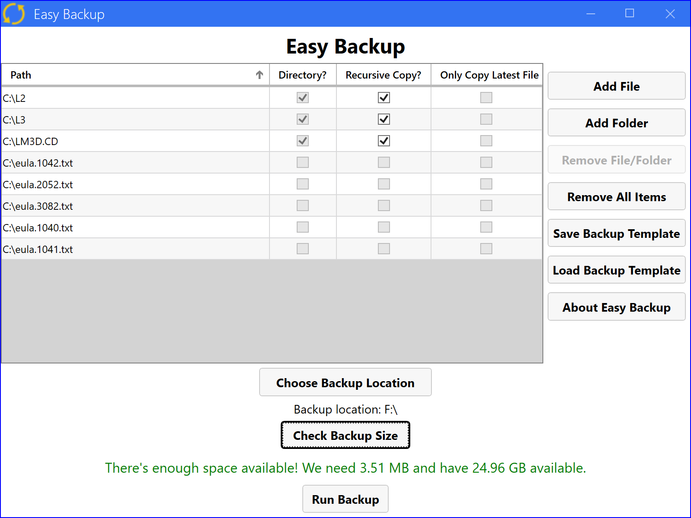
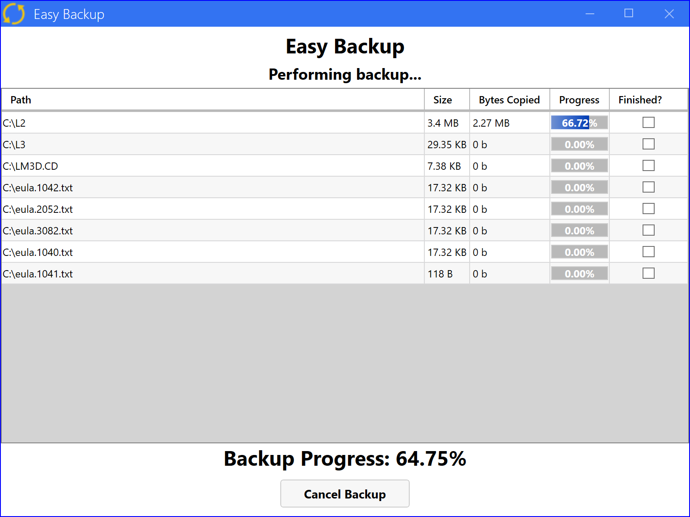

# Easy Backup

Easy Backup is a small Windows utility that allows you to copy files from one location to another for the purposes of a backup. That's it, really. No file compression or file security involved -- just a simple "copy this thing to this other place" application for quick and easy backups to an external or other drive.

Features include:

* Choose files or folders to backup (either via file dialogs or via drag & drop)
* Toggle recursive copy of directories on and off
* Save and load your backup locations as a template so that it's easy as pie to re-run a backup that you've run in the past
  * The most recently used backup template file is automatically loaded for you when starting the software. A backup is only a few clicks away!
* If copying a directory non-recursively, choose to only copy the last modified file in that directory. This could be useful when backing up a directory that contains local file backups, for example -- you may not need all the local backups, just the latest one.
* View backup progress as it happens
* Optional sounds when backup succeeds or fails
* Cancel backup at any time
* Files for backup can be compressed with or without a password (uses 7-zip LZMA compression).

## Screenshots

    
    

## Features/Updates to Come

* Option to update a previous backup instead of creating an entirely new backup (only adds new files and updates modified files based on a hash; does NOT delete old files that have been removed)

## Can I help contribute?

Glad you asked! There are always things that can be done on an open-source project: fix bugs, add new features, and more! Check out the issues tab of this repository and take a look at what bugs have been reported and which features have been requested. If you'd like to request a feature or file a bug, by all means, please do so!

## License

The core EasyBackup code is under the MIT License. Thanks for using this software!

Compressed files are created using [7-Zip](https://www.7-zip.org) (7za.exe). 7-Zip is licensed under the GNU LGPL license. You can find the source code for 7-Zip at [www.7-zip.org](https://www.7-zip.org).
